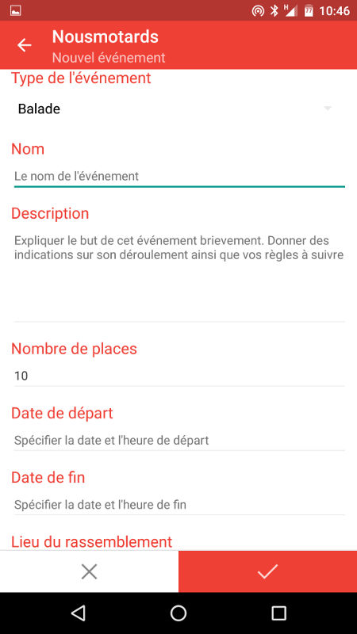

Questions les plus fréquentes
=============================

.. contents:: Topics

.. _install_nm:

Comment accéder à Nousmotards ?
-------------------------------

* Via `Android <https://play.google.com/store/apps/details?id=com.nousmotards.android>`_
* Via Apple iOS (disponible fin 2016)
* Via le `site web <https://www.nousmotards.com>`_

Comment créer un compte ?
-------------------------

Pour créer un compte Nousmotards c'est simple, il existe 2 solutions:

* Via l':ref:`account-application-mobile`.
* Via l':ref:`account-web-interface`.

Nous allons voir ces deux là en détails.

.. _account-application-mobile:

Application mobile
^^^^^^^^^^^^^^^^^^

Lancez l'application, une fois que vous l'avez :ref:`installée<install_nm>`:

.. image:: images/nm_android_login.jpg
    :align: center

Cliquez sur:

* *SE CONNECTER AVEC FACEBOOK*: pour se connecter via votre compte Facebook.
* *SE CONNECTER*: créer un compte dédié Noumotards

.. note:: Si vous avez opté pour Facebook, pas la peine d'aller plus loin, suivez les instructions à l'écran et vous serez connecté.

Si vous avez opté pour le compte Nousmotards, entrez simplement les informations suivantes et appuyez sur le bouton rouge en bas:

.. image:: images/nm_android_register.jpg
    :align: center

Votre compte sera alors créé et vous pourrez immédiatement utiliser Nousmotards.

.. note:: Veillez à ce que vos informations soient correct pour bénéficier de toutes les fonctionnalités de Nousmotards

.. _account-web-interface:

Interface web
^^^^^^^^^^^^^

Lorsque vous allez sur `l'interface web de Nousmotards <https://www.nousmotards.com>`_, vous verrez un encadré comme celui ci:

.. image:: images/nm_web_register.jpg
    :align: center

Cliquez sur:

* *SE CONNECTER AVEC FACEBOOK*: pour se connecter via votre compte Facebook.
* *SE CONNECTER*: créer un compte dédié Noumotards

Votre compte sera alors créé et vous pourrez immédiatement utiliser Nousmotards.

J'ai déjà un compte
-------------------

J'ai oublié mon mot de passe
^^^^^^^^^^^^^^^^^^^^^^^^^^^^

Réinitialisez votre mot de passe en `cliquant ici <https://www.nousmotards.com/mot-de-passe-perdu>`_.

J'ai oublié mon identifiant
^^^^^^^^^^^^^^^^^^^^^^^^^^^

`Contactez nous par mail <support@nousmotards.com>`_.

Je n'arrive pas à me connecter
^^^^^^^^^^^^^^^^^^^^^^^^^^^^^^

`Contactez nous par mail <support@nousmotards.com>`_.

Comment compléter mon profil ?
------------------------------

Vous pouvez choisir de remplir vos informations de deux façons. Via l'application mobile, en allant dans *Paramètres*, puis *Mon profil*. Ou bien via l'application web, en allant dans votre profil personnel. Pour aller dans cet espace, lorsque vous êtes connecté, allez en haut à droite et cliquez sur la petite flêche à côté de votre nom:

.. image:: images/nm_web_user_menu.jpg
    :align: center

Puis cliquez sur *Mon compte*. Vous pourrez alors remplir tous les champs nécessaire:

.. image:: images/nm_web_user_pref.jpg
    :align: center

.. note:: Il est important de compléter son profil pour plusieurs raisons. Tout d'abord pour que d'autre motards puissent vous retrouver simplement. Et puis ensuite car il est nécessaire pour certaines fonctionnalitées que ces informations soient complétées pour qu'elles fonctionnent correctement.

Qu'est-ce qu'une vente groupée ?
--------------------------------

La vente groupée est organisée régulièrement sur des produits demandés par la communauté. Grâce à nos partenaires, les membres de Nousmotards ont un accès privilégié à des articles à tarifs réduits.

Comment ne plus recevoir de mails ?
-----------------------------------

Si vous ne souhaitez plus recevoir de mails ou changer sa fréquence, vous devez aller sur l'interface web, lorsque vous êtes connecté, allez en haut à droite et cliquez sur la petite flêche à côté de votre nom:

.. image:: images/nm_web_user_menu.jpg
    :align: center

Puis cliquez sur *Notifications*. Vous pourrez alors changer la fréquence de notification et désactiver celle ci si vous le souhaitez:

.. image:: images/nm_web_notif.jpg
    :align: center

Cliquez sur le bouton *Mettre à jour* pour valider vos changements.

Comment ne plus recevoir de notifications sur mon téléphone ?
-------------------------------------------------------------

Pour ne plus recevoir les notifications sur téléphone ou bien supprimer simplement les sons, allez dans les paramètres de l'application. Vous trouverez ceci:

* *Notifications*: pour désactiver toutes les notifications de Nousmotards sur téléphone
* *Son des notifications*: pour désactiver uniquement les sons et non les notifications visuelles

.. image:: images/nm_android_pref_notif.jpg
    :align: center

Qu'est-ce qu'un club ?
----------------------

Les Clubs sont des groupes de motards ayant un même centre d'intérêt. Il en existe par exemple pour des évènements mondiaux comme les "Moto GP", par région de France ou autre comme le Stunt. C'est une manière de rassembler les personnes par rapport à leurs envies et intérêts.

Comme type de clubs, nous proposons:

* Groupe
* Association
* Boutique
* Garage
* Restaurant
* Hotel

Rejoindre un club
^^^^^^^^^^^^^^^^^

Pour rejoindre un Club, allez dans le menu "Clubs", vous obtiendez alors la liste des clubs disponible:

.. image:: images/nm_android_clubs_list.jpg
    :align: center

Si vous avez déjà une idée du club qui vous intéresserait, vous pouvez le chercher directement en appuyant sur l'icone de la loupe. Si nous cherchons "motogp" par exemple:

.. image:: images/nm_android_clubs_search_results.jpg
    :align: center

Appuyez sur le résultat qui vous intéresse pour obtenir la page d'accueil du club:

.. image:: images/nm_android_clubs_overview.jpg
    :align: center

Pour devenir membre du club, il ne vous reste plus qu'à activer le bouton "Suivre". Vous serez alors notifié lorsqu'un nouveau post sera présent dans le club.

Vous pouvez naviguer de gauche à droite et inversement pour voir les posts, images, membres, etc...relatifs au club.

Créer un club
^^^^^^^^^^^^^

Pour créer un club, allez dans le menu "Clubs", puis appuyez en haut à droite sur l'icône avec les deux têtes et un "+":

.. image:: images/nm_android_clubs_list.jpg
    :align: center

Une page vous proposant la création d'un club s'affichera alors:

.. image:: images/nm_android_clubs_create.jpg
    :align: center

Remplissez les champs nécessaires pour la création de votre club.

.. note:: Plus précises seront les informations de votre club, plus de participants vous aurez. C'est pourquoi il est important de remplir soigneusement tous les champs.

Qu'est-ce qu'un événement ?
---------------------------

Participer à un évènement
^^^^^^^^^^^^^^^^^^^^^^^^^

Pour participer à une balade, allez dans le menu, puis appuyez sur "Balades & évènements", vous obtiendez la liste des balades et évènements:

.. image:: images/nm_android_events_list.jpg
    :align: center

Pour particper à l'un d'entre eux, appuyez dessus pour obtenir sa description et ses informations:

.. image:: images/nm_android_events_overview.jpg
    :align: center

Pour participer à cet évènement, il suffit d'activer le bouton "Participer".

.. note:: Veillez à ce qu'il y ai bien des places disponible (ici 5 personnes sont déjà inscrites sur un maximum de 10).

Un événement permet à l’utilisateur d’organiser de manière simple une sortie, que ce soit une balade à moto, un resto ou une participation à une manifestation de grande ampleur. Le tout est géolocalisé et notifie les membres de "Nousmotards" proches dudit événement.

Proposer une balade ou un autre type d’événement
^^^^^^^^^^^^^^^^^^^^^^^^^^^^^^^^^^^^^^^^^^^^^^^^

Vous pouvez vous même créer votre évènement. C'est très utile si vous souhaitez qu'il y ai du monde qui soit notifié de votre évènement en fonction de la distance du lieu de rendez vous.

Pour créer un évènement, c'est simple, il suffit d'aller dans le menu des évènements, puis en appuyant sur le bouton "+" en haut à droite. Vous accéderez alors à une page de création comme celle ci:

Vous pourrez alors choisir entre plusieurs types d'évènements:

* Balade
* Manifestation
* Rassemblement
* Piste
* Repas
* Autre

A vous de choisir ce qui convient le mieux pour votre évènement. Remplissez les champs restant et validez. Les personnes souhaitant être notifiées et étant dans un rayon assez proche reçevront une alerte leur proposant de participer à cet évènement.

Qu'est-ce qu'un Roadbook ?
--------------------------

Créez vos parcours ! Avec l’outil de création de roadbooks, il est très facile de créer son parcours pour une balade et de le publier sur "Nousmotards". Que ce soit pour préparer le trajet de la sortie à venir, de l’exporter sur son GPS*, ou bien juste partager avec la communauté un bout de route sympathique.

..
  Créer un roadbook
  Exporter/importer un roadbook

.. disqus::
