La FAQ Nousmotards
==================

.. contents:: Topics

Comment créer un compte ?
-------------------------

Pour créer un compte Nousmotards c'est simple, il existe 2 solutions:

* Via l':ref:`account-application-mobile`.
* Via l':ref:`account-web-interface`.

Nous allons voir ces 2 là en détails.

.. _account-application-mobile:

Application mobile
^^^^^^^^^^^^^^^^^^

Lorsque vous avez `installé Nousmotards <https://play.google.com/store/apps/details?id=com.nousmotards.android>`_, lancez pour la première fois l'application, vous aurez alors la première page de login:

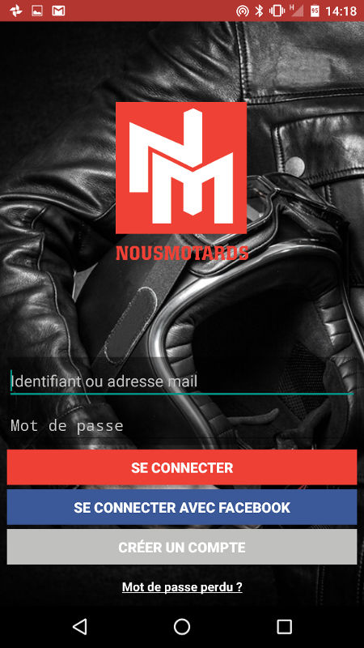

Vous pouvez alors vous créer un compte de 2 manières:

* *Facebook*: de façon très rapide via votre compte Facebook en cliquant sur le bouton *Facebook*.
* *Nousmotards*: vous pouvez créer un compte dédié Noumotards en appuyant sur le bouton *Créer un compte*.

Si vous avez opté pour Facebook, pas la peine d'aller plus loin, suivez les instructions à l'écran et vous serez connectés. Pour le compte dédié Nousmotards, entrez simplement les informations suivantes et appuyez sur le bouton rouge en bas:

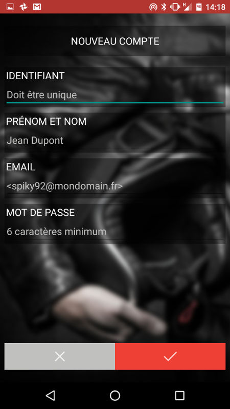

Votre compte sera alors créer et vous pourrez immédiatement utiliser Nousmotards.

.. note:: Veillez à ce que vos informations soient correct pour bénéficier de toutes les fonctionnalités de Nousmotards

.. _account-web-interface:

Interface web
^^^^^^^^^^^^^

Lorsque vous allez sur `l'interface web de Nousmotards <https://www.nousmotards.com>`_, vous verrez un encadré comme celui ci:

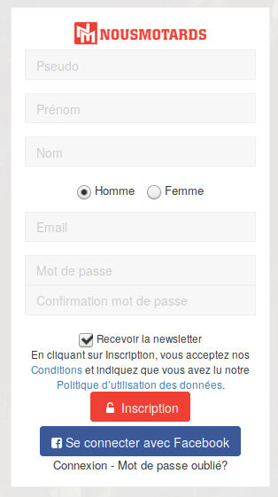

Vous pouvez alors vous créer un compte de 2 manières:

* *Facebook*: de façon très rapide via votre compte Facebook en cliquant sur le bouton *Facebook*.
* *Nousmotards*: vous pouvez créer un compte dédié Noumotards en remplissant les champs indiqués, puis en cliquant sur le bouton *Inscription*.

Votre compte sera alors créer et vous pourrez immédiatement utiliser Nousmotards.

Comment compléter mon profil ?
------------------------------

Il est important de compléter son profil pour plusieurs raisons. Tout d'abord pour que d'autre motards puissent vous retrouver simplement. Et puis ensuite car il est nécessaire pour certaines fonctionnalitées que ces informations soient correctement remplie pour qu'elles fonctionnent correctement.

Vous pouvez choisir de remplir vos informations de 2 façons. Via l'application mobile, en allant dans *Paramètres*, puis *Mon profil*. Ou bien via l'application web, en allant dans votre profil personnel. Pour aller dans cet espace, lorsque vous êtes connecté, allez en haut à droite et cliquez sur la petite flêche à côté de votre nom:

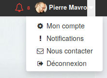

Puis cliquez sur *Mon compte*. Vous pourrez alors remplir tous les champs nécessaire:

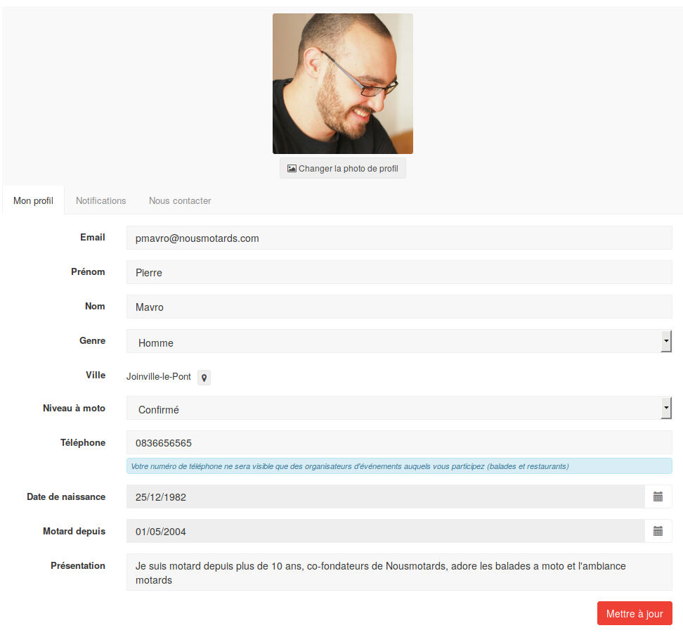

Comment ne plus recevoir de mails ?
-----------------------------------

Si vous ne souhaitez plus recevoir de mails ou changer sa fréquence, vous devez aller sur l'interface web, lorsque vous êtes connecté, allez en haut à droite et cliquez sur la petite flêche à côté de votre nom:

Puis cliquez sur *Notifications*. Vous pourrez alors changer la fréquence de notification et désactiver celle ci si vous le souhaitez:

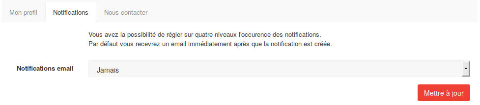

Cliquez sur le bouton *Mettre à jour* pour valider vos changements.

Comment ne plus recevoir de notifications sur mon téléphone ?
-------------------------------------------------------------

Pour ne plus recevoir les notifications sur téléphone ou bien supprimer simplement les sons, allez dans les paramètres de l'application. Vous trouverez ceci:

* *Notifications*: pour désactiver toutes les notifications de Nousmotards sur téléphone
* *Son des notifications*: pour désactiver uniquement les sons et non les notifications visuelles

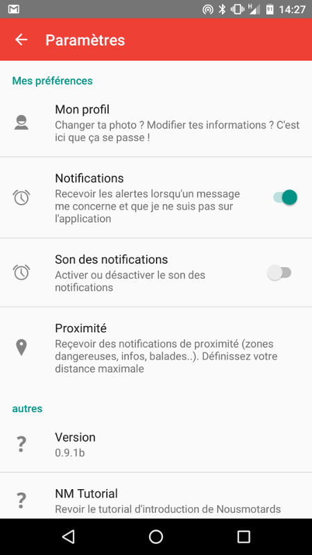

Ajouter des motards comme ami
-----------------------------

Rejoindre ou créer un club
--------------------------

Les Clubs sont des groupes de motards ayant un même centre d'intérêt. Il en existe par exemple pour des évènements mondiaux comme les "Moto GP", par région de France ou autre comme le Stunt. C'est une manière de rassembler les personnes par rapport à leurs envies et intérêts.

Comme type de clubs, nous proposons:

* Groupe
* Association
* Boutique
* Garage
* Restaurant
* Hotel

Rejoindre un club
^^^^^^^^^^^^^^^^^

Pour rejoindre un Club, allez dans le menu "Clubs", vous obtiendez alors la liste des clubs disponible:

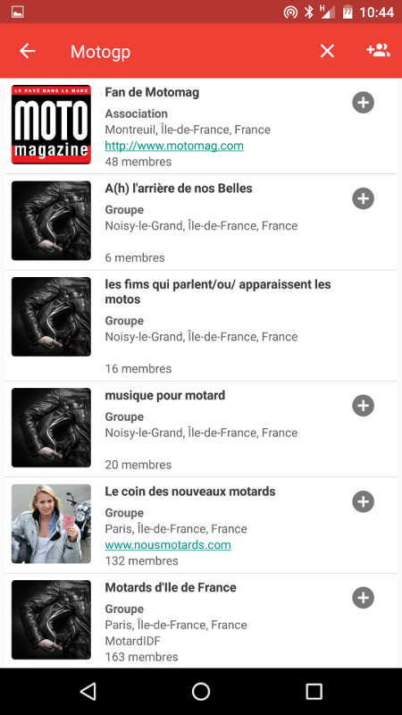

Si vous avez déjà une idée du club qui vous intéresserait, vous pouvez le chercher directement en appuyant sur l'icone de la loupe. Si nous cherchons "motogp" par exemple:

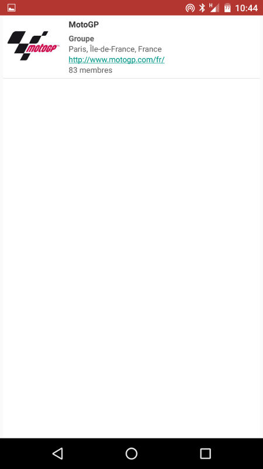

Appuyez sur le résultat qui vous intéresse pour obtenir la page d'accueil du club:

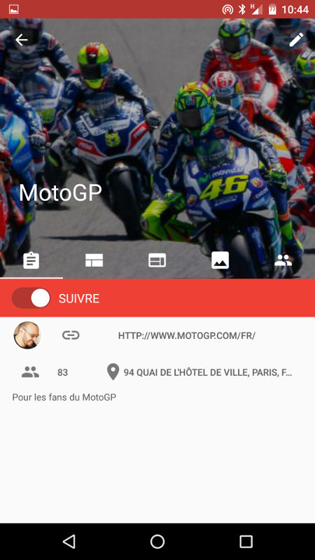

Pour devenir membre du club, il ne vous reste plus qu'à activer le bouton "Suivre". Vous serez alors notifié lorsqu'un nouveau post sera présent dans le club.

Vous pouvez naviguer de gauche à droite et inversement pour voir les posts, images, membres, etc...relatifs au club.

Créer un club
^^^^^^^^^^^^^

Pour créer un club, allez dans le menu "Clubs", puis appuyez en haut à droite sur l'icône avec les 2 têtes et un "+":

Une page vous proposant la création d'un club s'affichera alors:

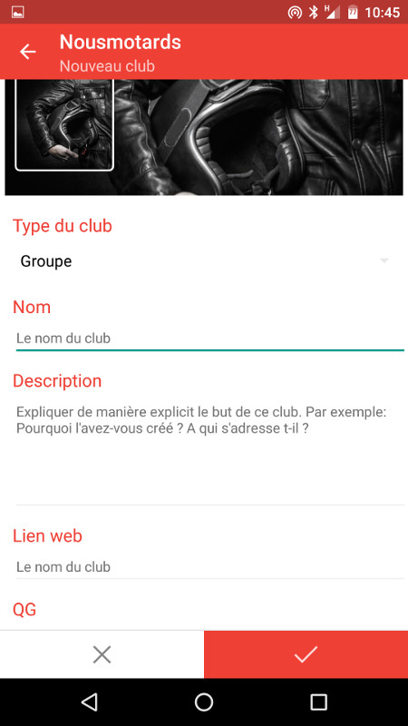

Remplissez les champs nécessaire pour la création de votre club.

.. note:: Le mieux vous remplirez les informations de votre club, le plus de participants vous aurez. C'est pourquoi il est important de remplir soigneusement tous les champs.

Participer à une balade
-----------------------

Pour participer à une balade, allez dans le menu, puis appuyez sur "Balades & évènements", vous obtiendez la liste des balades et évènements:

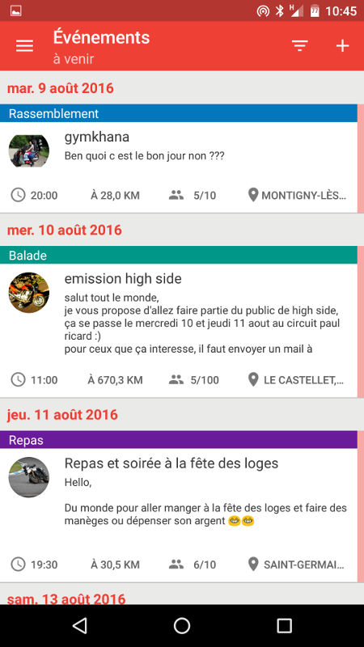

Pour particper à l'un d'entre eux, appuyez dessus pour obtenir sa description et ses informations:

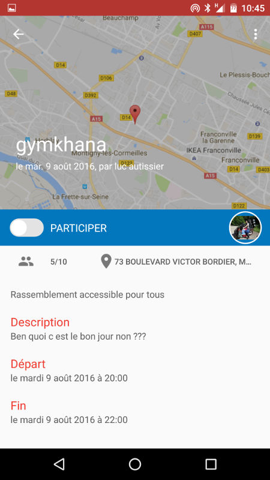

Pour participer à cet évènement, il suffit d'activer le bouton "Participer".

.. note:: Veillez à ce qu'il y ai bien des places disponible (ici 5 personnes sont déjà inscrites sur un maximum de 10).

Proposer une balade ou un autre type d’événement
------------------------------------------------

Créer un roadbook
-----------------

Exporter/importer un roadbook
-----------------------------

.. disqus::
